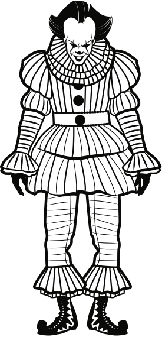
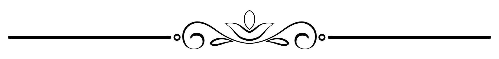
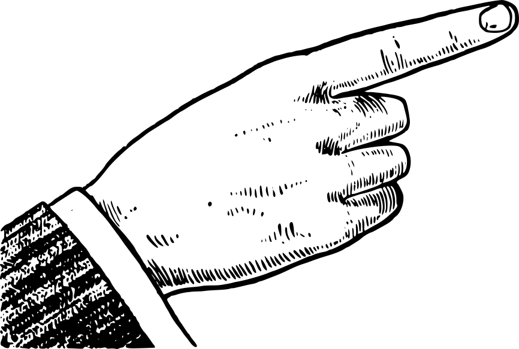
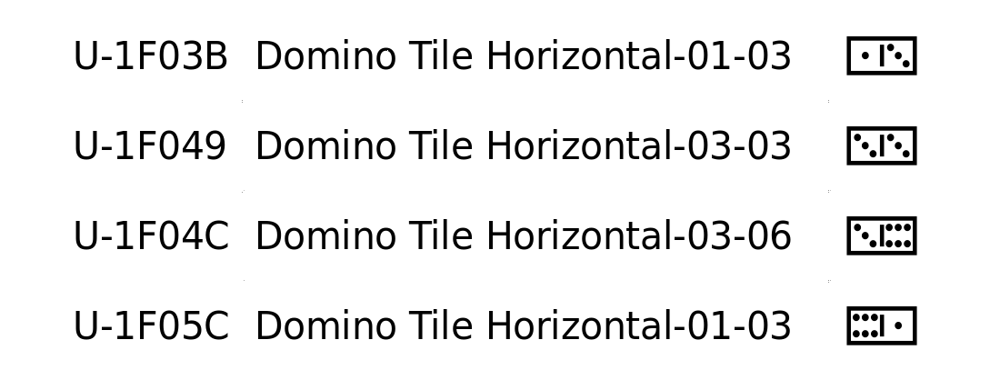
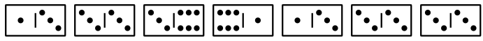
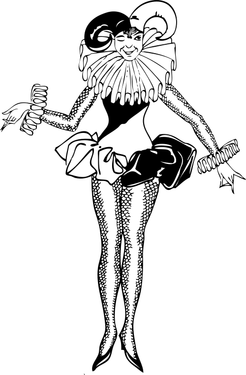
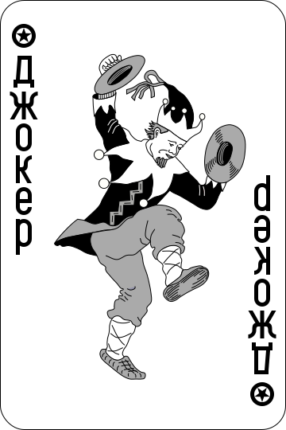

---
title: The Puzzling Quirks of Regular Expresssions
author: ["David Mertz, Ph.D."]
date: "2021-08-01"
keywords: [Regular Expressions, Python]
documentclass: book
papersize: a5
geometry:
    - margin=0.5in
    - top=0.75in
    - bottom=0.5in
number-sections: true
toc: true
mainfont: DejaVuSerif.ttf
mainfontoptions:
    - Extension=.ttf
    - UprightFont=*
    - BoldFont=*-Bold
    - ItalicFont=*-Italic
    - BoldItalicFont=*-BoldItalic
sansfont: DejaVuSans.ttf
monofont: DejaVuSansMono.ttf 
mathfont: texgyredejavu-math.otf 
...

# Acknowledgments

I thank my friend Miki Tebeka, who invited me to write this book, albeit
in slightly different form than the version you see.  I am very grateful
to my friends Brad Huntting and Mary Ann Sushinsky who provided clever
ideas in the directions of these puzzles.

A number of other friends and family members listened to me enumerate
the foibles of another publisher who clings to a cargo-culted toolchain.

With ambivalence, I thank Noam Chomsky for arranging computability into
a neat hierarchy, with regular expressions at the bottom.

*Freely licensed images used*

Leo Reynolds (CC BY-NC-SA 2.0): joker-48067975746_0db0b8eba0_o.jpg

Pixabay (https://pixabay.com/service/license/): clown-28772.svg 

Dmitry Fomin (CC0 1.0): Atlas_deck_joker_black.svg

freesvg.org (Public Domain): clown-1549219095.svg;
johnny-automatic-left-hand-1.svg; pointerfingerright.svg

OpenClipArt (Public Domain): Elegant-Flourish-Frame-Extrapolated-19.svg

"Stuck in the Middle with You", by Gerry Rafferty and Joe Egan (Stealer
Wheels), 1973:

> Clowns to the left of me! /
> Jokers to the right! /
> Here I am stuck in the middle with you.



# Preface

Regular expressions—sometimes given the playful back formation *regexen*
or more neurally *regex*—are a powerful and compact way of describing
patterns in text.  Many tutorials and "cheat sheets" exist to understand
their syntax and semantics in a formally correct manner.  I encourage
you to read some of those, if you have not already.

These puzzles begin at a certain point where the formal descriptions
leave off.  As you work with regexen, you will find subtle pitfalls.  A
pattern that seems like it should obviously match one thing, actually
matches something slightly different than you intended.  Or perhaps a
match pattern has "pathological" behavior and takes far too long.  Or
sometimes it is simply that a more concise pattern can also be clearer
in describing what you actually wish to match. 

A great many programming languages, libraries, and tools support regular
expressions, with relatively minor variations in the syntax used.  Such
software includes `[efr]?grep`, `sed`, `awk`, *Perl*, *Java*, *.NET*,
*JavaScript*, *Julia*, *XML Schema*, or indeed, pretty much every other
programming language via a library. 

For this book, we will use Python to pose these puzzles.  In particular,
we will use the standard library module `re`  Often code samples are
used in puzzles and in explanation; where I wish to show the output from
code, the example emulates to the Python shell with lines starting with
`>>> ` (or continuing with `... `).  Outputs are echoed without a prompt
in this case.  Where code defines a function that is not necessarily
executed in the mention, only the plain code is shown. 

While you are reading this book, I strongly encourage you to keep
open an interactive Python environment.  Many tools enable this, such
as the Python REPL (read-evaluate-print-loop) itself, or the IPython
enhanced REPL, or Jupyter notebooks, or the IDLE editor that comes
with Python, or indeed most modern code editors and IDEs (integrated
development environment).  A number of online regular expression 
testers are also available, although those will not capture
the details of the Python calling details.  Explanations will follow
each puzzle, but trying to work it out in code before reading it is
worthwhile. 

# Quantifiers and Special Sub-Patterns

Solving the puzzles in this section will require you to have a good
understanding of the different quantifiers that regular expressions
provide, and to pay careful attention to when you should use
sub-patterns (themselves likely quanitifed).


\newpage

## Wildcard Scope

A powerful element of Python regular expression syntax—shared by many
other regex engines—is the option of creating either "greedy" or
"non-greedy" matches.  The former matches as much as it possibly can, as
long as it finds the later part of a pattern.  The latter matches as
little as it possibly can to reach the next part of a pattern.

Suppose you have these two regular expressions:

```
pat1 = re.compile(r'x.*y')    # greedy
pat2 = re.compile(r'x.*?y')   # non-greedy
```

And also this block of text that you want to match.  You can think of it
as a sort of *lorem ipsum* that only has 'X' words, if you will.

```
txt = """
xenarthral xerically xenomorphically xebec xenomania 
xenogenic xenogeny xenophobically xenon xenomenia 
xylotomy xenogenies xenografts xeroxing xenons xanthous 
xenoglossy xanthopterins xenoglossy xeroxed xenophoby 
xenoglossies xanthoxyls xenoglossias xenomorphically 
xeroxes xanthopterin xebecs xenodochiums xenodochium
xylopyrography xanthopterines xerochasy xenium xenic 
"""
```

You'd like to match all and only words that start with 'X' and end with
'Y'.  What pattern makes sense to use, and why?  The code to find the
words can look like:

```
xy_words = re.findall(_pat, txt)
```

Before you turn the page...

**Think about what each pattern will match.**



\newpage

Did this puzzle fool you? Welcome to the world of regular expressions!
Both `pat1` and `pat2` match the wrong thing, but in different ways.

If you liked `pat1`, you've greedily matched too much. The 'y' might
occur in later words (per line), and the match won't end until the last
'y' on a line.

```
>>> for match in re.findall(pat1, txt):
...     print(match)
...
xenarthral xerically xenomorphically
xenogenic xenogeny xenophobically
xylotomy
xenoglossy xanthopterins xenoglossy xeroxed xenophoby
xenoglossies xanthoxyls xenoglossias xenomorphically
xylopyrography xanthopterines xerochasy
```

On each line, the greedy pattern started at the first 'x', which is
often not what you want.  Moreover, most lines match multiple words,
with only the line beginning with 'xylotomy' happening to be the only
word we actually want.  The line that begins with 'xeroxes' is not
matched at all, which is what we want.

If you liked `pat2` you often get words, but at other times either 
too much *or too little* might be matched.  For example, if 'xy' occurs 
in a longer word, either as a prefix or in the middle, it can also match. 


```
>>> for match in re.findall(pat2, txt):
...     print(match)
...
...
xenarthral xerically
xenomorphically
xenogenic xenogeny
xenophobically
xy
xenoglossy
xanthopterins xenoglossy
xeroxed xenophoby
xenoglossies xanthoxy
xenoglossias xenomorphically
xy
xanthopterines xerochasy
```

By being non-greedy, we stop when the first 'y' is encountered, but as
you see, that still is not quite what we want.

What we actually need to focus on for this task is the *word
boundaries*. Things that are not letters (for our wordlist, all are
lowercase) cannot be part of matches. In this simple case, non-letters
are all spaces and newlines, but other characters might occur in other
texts.
 
We can be greedy to avoid matching prefixes or infixes, but we also 
want to ignore non-letter characters..


```
>>> pat3 = re.compile(r'x[a-z]*y')
>>> for match in re.findall(pat3, txt):
...     print(match)
...
xerically
xenomorphically
xenogeny
xenophobically
xylotomy
xenoglossy
xenoglossy
xenophoby
xanthoxy
xenomorphically
xylopyrography
xerochasy
```

Everything we matched, anywhere on each line, had an 'x', some other
letters (perhaps including 'x's or 'y's along the way), then a 'y'.
Whatever came after each match was a non-letter character.


\newpage

## Words and Sequences
	
In the previous problem, we identified words that started with 'x' and
ended with 'y'.  You may have noticed, however, that we had already
included the assumption that all the words started with 'x'.  Perhaps
your solution was clever enough not to fall for the danger shown in this
puzzle.  Namely, perhaps not all words will actually start with 'x' to
begin with.

```
>>> txt = """
expurgatory xylometer xenotime xenomorphically exquisitely
xylology xiphosurans xenophile oxytocin xylogen
xeriscapes xerochasy inexplicably exabyte inexpressibly
extremity xiphophyllous xylographic complexly vexillology
xanthenes xylenol xylol xylenes coextensively
"""
>>> pat3 = re.compile(r'x[a-z]*y')
>>> re.findall(pat3, txt)
['xpurgatory', 'xy', 'xenomorphically', 'xquisitely', 
'xylology', 'xy', 'xy', 'xerochasy', 'xplicably', 'xaby', 
'xpressibly', 'xtremity', 'xiphophy', 'xy', 'xly', 
'xillology', 'xy', 'xy', 'xy', 'xtensively']
```

As you can see, we matched a number of substrings within word, not only
whole words.  What pattern can you use actually to match only words that
start with 'x' and end with 'y'?

Before you turn the page...

**Think about what defines word boundaries.**


\newpage

There are a few ways you might approach this task.  The easiest is to
use the explicit "word boundary" special *zero-width match* pattern,
spelled as `\b` in Python and many other regular expression engines.


```
>>> pat4 = re.compile(r'\bx[a-z]*y\b')
>>> re.findall(pat4, txt)
['xenomorphically', 'xylology', 'xerochasy']
```

Less easy ways to accomplish this include using look-ahead and
look-behind to find non-matching characters that must "bracket" the
actual match.  For example:


```
>>> pat5 = r'(?<=^|(?<=[^a-z]))x[a-z]+y(?=$|[^a-z])')
>>> re.findall(pat5, txt)
['xenomorphically', 'xylology', 'xerochasy']
```

One trick here is that when we perform a look-behind assertion, it must
have a fixed width of the match.  However, words in our list might
either follow spaces or occur at the start of a line.  So we need to
create an alternation between the zero-width look-behind and the one
non-letter character look-behind. For the look-ahead element, it is
enough to say it is *either* end-of-line (`$`) *or* is a non-letter
(`[^a-z]`).


\newpage

## Endpoint Classes

	
This puzzle continues the word matching theme of the last two puzzles.
However, here we have a new wrinkle.  We would like to identify *both*
words that start with 'x' and end with 'y', but *also* words that start
with 'y' and end with 'x'.

Remembering the word boundary special zero-width pattern we already saw, a first try at this task might be:


```
>>> txt = """
expurgatory xylometer yex xenomorphically exquisitely
xylology xiphosurans xenophile yunx oxytocin xylogen
xeriscapes xerochasy inexplicably yonderly inexpressibly
extremity xerox xylographic complexly vexillology
xanthenes xylenol xylol yexing xylenes coextensively
>>> pat6 = re.compile(r'\b[xy][a-z]*[xy]\b')
>>> re.findall(pat6, txt)
['yex', 'xenomorphically', 'xylology', 'yunx', 'xerochasy', 
'yonderly', 'xerox']
"""
```

What went wrong there? Clearly we matched some words we do not want,
even though all of them began with 'x' or 'y' and ended with 'x' or 'y'.

Before you turn the page...

**Try to refine the regular expression to match what we want.**


\newpage

The first pattern shown allows for either 'x' or 'y' to occur at either
the beginning or the end of a word.  The word boundaries are handled
fine, but this allows words both beginning and ending with 'x', and
likewise beginning and ending with 'y'.  The character classes at each
end of the overall pattern are independent.

This may seem obvious on reflection, but it is very much like errors I
myself have made embarrassingly many times in real code. A robust
approach is simply to list everything you want as alternatives in a
pattern.

 
```
>>> pat7 = re.compile(r'\b((x[a-z]*y)|(y[a-z]*x))\b')
>>> [m[0] for m in re.findall(pat7, txt)]
['yex', 'xenomorphically', 'xylology', 'yunx', 'xerochasy']
```

In this solution, there is a little bit of Python specific detail in the
function API.  The function `re.findall()` returns tuples when a pattern
contains multiple groups.  Group 1 will be the whole word, but one or
the other of group 2 and 3 will be blank, i.e.:

 
```
>>> re.findall(pat7, txt)
[('yex', '', 'yex'), 
('xenomorphically', 'xenomorphically', ''), 
('xylology', 'xylology', ''), 
('yunx', '', 'yunx'), 
('xerochasy', 'xerochasy', '')]
```

	

\newpage

## A Configuration Format

	
This exercise requires just a little bit of Python itself, but is mainly
about choosing the right regular expression.  Let's suppose you have a
configuration format that looks like this:


```
config = """
3 = foobar
14=baz
9= fizzbuzz
21=more_stuff,here
"""
```

With a little bit of code, and using a regular expression, you wish to
convert text in this format to a dictionary mapping the numbers to the
left of the equal sign to the strings to the right.  For example, the
above example would produce:


```
{3: 'foobar', 14: 'baz', 9: 'fizzbuzz', 21: 'more_stuff,here'}
```

Before you turn the page...

**Remember that shapes have edges.**


\newpage

As the example shows, there seems to be flexibility in spaces around the
two sides of the equal sign.  We should probably assume zero or more
spaces are permitted on either side.  The format is probably slightly
surprising in that we would more commonly use words on the left and
numbers on the right in most formats; but it is well-defined enough, and
we can stipulate it has a purpose.

The easiest way to capture the relevant information is probably by using
groups for each side, which will be exposed by `re.findall()` and other
regular expression functions.  We *almost* get the right answer with
this:

 
```
>>> dict(re.findall(r'^(\d+) *= *(.*)$', s, re.MULTILINE))
{'3': 'foobar', '14': 'baz', '9': 'fizzbuzz', 
'21': 'more_stuff,here'}
```

Notice that we required the "multiline" modifier to match on each line
of the string.  The one problem is that the puzzle requested that
numbers appear as numbers not as strings of digits.  There are a number
of ways we might achieve that in Python, but one easy one is:


```
>>> {int(k): v for k, v in 
            re.findall(r'^(\d+) *= *(.*)$', s, re.MULTILINE)}
{3: 'foobar', 14: 'baz', 9: 'fizzbuzz', 21: 'more_stuff,here'}
```

	

\newpage

## The Human Genome


Genomics commonly uses a format called FASTA to represent genetic
sequences.  This puzzle uses a subset of the overall format.  Let's
provide just a few quick tips.  The letters 'A', 'C', 'G', 'T' represent
nucleotide bases in DNA.  FASTA may also contains the symbol 'N' for
"unknown nucleotide" and '-' for "gap of indeterminate length."

As well, in biological organisms, spans of DNA are terminated by
"telomeres" which are special sequences which indicate that the read
mechanism should stop transcription and form a protein.  Telomeres are
often repeated as much as thousands of times at the ends of sequences.
In a gross simplification for this puzzle, let's suppose that three or
more repetitions of a telomere indicate the end of a sequence for a
protein. In vertebrates, the telomere used is 'TTAGGG'.

In this puzzle, we will ignore the marking of the start of a
protein-encoding region, and just assume that all of our strings begin a
potential protein encoding.

You would like to create a regular expression that represents a
"specific protein encoding" from a (simplified) FASTA fragment.  In
particular, we need to know exactly which nucleotides are present, and
gaps or unknown nucleotides will prevent a match.  Moreover, even the
telomere repetitions at the end are not permitted (for this puzzle) to
have gaps or unknowns.

For this puzzle, assume that all the FASTA symbols are on a single line.
Normally as published they have a fixed width less than 80 characters;
but newlines are simply ignored.  Examples of matches and failures:


```
>>> from textwrap import wrap
>>> print('\n'.join(wrap(valid, 60)))
CATGGCTTTGGGACAACTCGGGGCTGCATGGACGGTGAATAAAATCTTTCCCGGTTGCTG
CCCTGAATAATCAAGGTCACAGACCAGTTAGAATGGTTTAGTGTGGAAAGCGGGAAACGA
AAAGCCTCTCTGAATCCTGCGCACCGAGATTCTCCCAAGGCAAGGCGAGGGGCTGTATTG
CAGGGTTCAACTGCAGCGTCGCAACTCAAATGCAGCATTCCTAATGCACACATGACACCC
AAAATATAACAGACATATTACTCATGGAGGGTGAGGGTGAGGGTGAGGGTTAGGGTTAGG
GTTTAGGGTTAGGGTTAGGGGTTAGGGGTTAGGGTTAGGGTTAGGGTTAGGG

>>> coding = re.search(pat, valid).group()
>>> print('\n'.join(wrap(coding, 60)))
CATGGCTTTGGGACAACTCGGGGCTGCATGGACGGTGAATAAAATCTTTCCCGGTTGCTG
CCCTGAATAATCAAGGTCACAGACCAGTTAGAATGGTTTAGTGTGGAAAGCGGGAAACGA
AAAGCCTCTCTGAATCCTGCGCACCGAGATTCTCCCAAGGCAAGGCGAGGGGCTGTATTG
CAGGGTTCAACTGCAGCGTCGCAACTCAAATGCAGCATTCCTAATGCACACATGACACCC
AAAATATAACAGACATATTACTCATGGAGGGTGAGGGTGAGGGTGAGGG
```

The telomeres at the end are ignored.  In contrast, it we use a
non-specifi symbol, we will not match.


```
>>> print('\n'.join(wrap(bad_telomere, 60)))
CATGGCTTTGGGACAACTCGGGGCTGCATGGACGGTGAATAAAATCTTTCCCGGTTGCTG
CCCTGAATAATCAAGGTCACAGACCAGTTAGAATGGTTTAGTGTGGAAAGCGGGAAACGA
AAAGCCTCTCTGAATCCTGCGCACCGAGATTCTCCCAAGGCAAGGCGAGGGGCTGTATTG
CAGGGTTCAACTGCAGCGTCGCAACTCAAATGCAGCATTCCTAATGCACACATGACACCC
AAAATATAACAGACATATTACTCATGGAGGGTGAGGGTGAGGGTGAGGGTTAGGGTTAGG
GTTTAGGGTTAGGGTTAGGGGTTAGGGGTTAGGGTTAGGGTTAGGGTTTAGG
>>> re.search(pat, bad_telomere) or "No Match"
'No Match'

>>> print('\n'.join(wrap(unknown_nucleotide, 60)))
CATGGCTTTGGGACAACTCGGGGCTGCATGGACGGTGAATAAAATCTTTCCCGGTTGCTG
CCCTGAATAATCAAGGTCACAGACCAGTTAGAATGGTTTAGTGTGGAAAGCGGGAAACGA
AAAGCCTCNCTGAATCCTGCGCACCGAGATTCTCCCAAGGCAAGGCGAGGGGCTGTATTG
CAGGGTTCAACTGCAGCGTCGCAACTCAAATGCAGCATTCCTAATGCACACATGACACCC
AAAATATAACAGACATATTACTCATGGAGGGTGAGGGTGAGGGTGAGGGTTAGGGTTAGG
GTTTAGGGTTAGGGTTAGGGGTTAGGGGTTAGGGTTAGGGTTAGGGTTAGGG
>>> re.search(pat, unknown_nucleotide) or "No Match"
'No Match'
```

In the one mismatch, the first several, but not all trailing bases are
valid telomeres.  In the second mismatch, the 'N' symbol is used.  Both
of these are valid FASTA encoding, but not the sequences specified for
puzzle.

Before you turn the page.

**Remember the central dogma of molecular biology.**




\newpage

There are a few key aspect to keep in mind in designing your regular
expression.  You want to make sure that your pattern begins at the start
of the candidate sequence.  Otherwise, you could easily match only a
valid tail of it.

From there, any sequence of 'C', 'A', 'T', and 'G' symbols is permitted.
However, you definitely want to be non-greedy in matching them since no
telomeres should be included.  The telomere may be repeated any number
of times, but at least three.  Moreover, repeated telomeres must
continue until the end of the candidate sequence, so we must match `$`
*inside* the lookahead pattern.


```
pat = r'^([CATG]+?)(?=(TTAGGG){3,}$)'
```

# Pitfalls and Sand in the Gears

As compact and expressive as regular expressions can be, there are times
when they simply go disasterously wrong.  Be careful to avoid, or at
least to understand and identify, where such difficulties arise.

\newpage

## Catastrophic Backtracking

In this puzzle, we imagine a certain message protocol (as we do in many
of the other puzzles).  We have an message alphabet that consists of the
following symbols:

| Code point | Name            | Appearance
|------------|-----------------|------------
| U+25A0     | Black Square    | ■
| U+25AA     | Black Sm Square | ▪
| U+25CB     | White Circle    | ○
| U+25C9     | Fisheye         | ◉
| U+25A1     | White Square    | □
| U+25AB     | White Sm Square | ▫
| U+25B2     | Black Up Triang | ▲
| U+25CF     | Black Circle    | ●
| U+2404     | End Transmit    | ! (substituted)

These geometric characters are attractive and are chosen to avoid
thinking of matches in terms of natural language words that some other
puzzles utilize.  However, feel free in solving it to substitute letters
or numerals, which are probably easier to type in your shell.  As long
as the correspondences are one-to-one, it doesn't matter what symbols
are used.

A message in this protocol consists of alternating blocks, belonging to
either "type 1" or "type 2".  Each block has at least one symbol in it,
but type 1 can have any of black square, black up triangle, white
circle, fisheye, or white square, in any number and order of each.  Type
2 blocks, in contrast, may have white small square, white square, black
small square, black circle, or black up triangle, in the same way.
Optionally, a space may separate blocks, but it is not required.

The "end of transmission" character indicates the end of a message.

An "obvious" pattern to describe a valid message apparently
matches appropriately. Some example are shown below:

```
Regex: (^(([■▲○◉□]+) ?([▫□▪●▲]+) ?)+)!

Structure 1/2/1/2  | Message '■▲◉▫■▪▫!' is Valid
Structure 1 2 1 2  | Message '■▲◉ ▫ ■ ▪▫!' is Valid
Missing terminator | Message '■▲◉▫■▪▫' is Invalid
Structure 1 1 2 1  | Message '▲▲▲ ■■■ ▫▫▫ ○○○!' is Invalid
```

The regex pattern shown actually *is* correct in a mathematical sense.
However, it can also become unworkably slow when checking some messages.
For example:

```
Quick match     |
        '■▲○◉□▫□▪●◉◉▫▪▪●●□□▲▲○○◉■■■▲▲□□◉▲!' is Valid
                |  Checked in 0.00 seconds
Quick failure   |
        '■▲○◉■▲▫▪●●■■■▲▲◉◉◉■□□□▫▫▪●●●▫■■■!' is Invalid
                |  Checked in 0.00 seconds
Failure         | '▲□□▲▲□□▲▲▲□□□□□□□□▲▲□▲□▲□▲X' is Invalid
                |  Checked in 4.42 seconds
Slow failure    | '▲□□▲▲▲□□▲▲▲□□□□□□□□▲▲□▲□▲□▲X' is Invalid
                |  Checked in 8.62 seconds
Exponential     | '▲▲▲▲▲▲□□▲▲▲□□□□□□□□▲▲□▲□▲□▲▲X' is Invalid
                |  Checked in 17.59 seconds
One more symbol | '▲▲▲▲□▲□□▲▲□▲□□□□□□□□▲▲□▲□▲□▲▲' is Invalid
                |  Checked in 31.53 seconds
```

Why does this happen?! Both the valid and the first invalid pattern
timed are longer than those that detect mismatches slowly.  You can see
that the time to determine the last four messages are invalid
approximately doubles with each additional character.

Before you look at explanation, both determine why this occurs and come
up with a solution using an alternate regular expression that still
validates the message format.  Your solution should take a small
fraction of a second in all cases (even messages that are thousands of
symbols long).

Note that as in other puzzles that use special characters for visual
presentation, you may find experimenting easier if you substitute
letters or numerals that are easy to type for the symbols used here.  It
doesn't change the nature of the puzzle at all; it merely might make it
easier to use your keyboard.

Before you turn the page...

**Try hard to avoid catastrophies.**


\newpage

The reason why the slow-failing messages fail is somewhat obvious to
human eyes.  None of them end with the "end-of-transmission" character.
As you can see, whether they end with an entirely invalid symbol `X` or
simply with a valid symbol and no terminator, is not significant.

You may want to think about whey the quick-failing message also fails.
Pause for a moment. 

But then notice that the final few symbols in that message are "black
square" which can only occur in type 1 blocks; a type 2 block must
always come immediatey before the end-of-transmission terminator.
Nonetheless, the regular expression engine figures that out in
(significantly) less than 1/100th of a second.

What you need to notice is that the symbol set overlaps between type 1
blocks and type 2 blocks. Therefore, it is ambiguous whether a given
symbol belongs to a given block or the next block.  If we simply look
for a match, *one possible* match is found quickly, when it exists.  For
example, this message that has only the ambiguous "white square" and
"black up triangle" validates immediately.  However we do not know how
many blocks of type 1 and how many of type 2 were created in the match
(pedantically, I know enough about the internals of the regular
expression engine to know that answer, but we are not guaranteed by the
API; it could be different in a later version of the library without
breaking compatibility).

```
Ambiguous quick | '▲▲▲▲□▲□□▲▲□▲□□□□□□□□▲▲□▲□▲□▲▲!' is Valid
                |  Checked in 0.00 seconds
```

Regular expressions are not smart enough to look ahead to the final
symbol to make sure it is a terminator, unless we tell it to do so.  The
produced answer is still *eventually* correct, but it is not as
efficient as we would like.  The engine tries every possible permutation
of "some symbols in this block, some in that"—which is of exponential
complexity on the length of the message—before it finally decides that
none match.

Let's solve that by doing a little extra work for the engine.
Specifically, before we try to identify alternating type 1 and type 2
blocks, let's just make sure that the entire message is made up of valid
symbols that end with the terminator symbol.  That check will complete
almost instantly, and will eliminate very many (but not all) ways of
encountering catastrophic backtracking.

```
Regex: (^(?=^[■▲○◉□▫▪● ]+!)(([■▲○◉□]+) ?([▫□▪●▲]+) ?)+)!

Structure 1/2/1/2  | Message '■▲◉▫■▪▫!' is Valid
Structure 1 2 1 2  | Message '■▲◉ ▫ ■ ▪▫!' is Valid
Missing terminator | Message '■▲◉▫■▪▫' is Invalid
Structure 1 1 2 1  | Message '▲▲▲ ■■■ ▫▫▫ ○○○!' is Invalid

Quick match     | 
        '■▲○◉□▫□▪●◉◉▫▪▪●●□□▲▲○○◉■■■▲▲□□◉▲!' is Valid
                |  Checked in 0.00 seconds
Quick failure   | 
        '■▲○◉■▲▫▪●●■■■▲▲◉◉◉■□□□▫▫▪●●●▫■■■!' is Invalid
                |  Checked in 0.00 seconds
Failure         | '▲□□▲▲□□▲▲▲□□□□□□□□▲▲□▲□▲□▲X' is Invalid
                |  Checked in 0.00 seconds
Slow failure    | '▲□□▲▲▲□□▲▲▲□□□□□□□□▲▲□▲□▲□▲X' is Invalid
                |  Checked in 0.00 seconds
Exponential     | '▲▲▲▲▲▲□□▲▲▲□□□□□□□□▲▲□▲□▲□▲▲X' is Invalid
                |  Checked in 0.00 seconds
One more symbol | '▲▲▲▲□▲□□▲▲□▲□□□□□□□□▲▲□▲□▲□▲▲' is Invalid
                |  Checked in 0.00 seconds
Ambiguous quick | '▲▲▲▲□▲□□▲▲□▲□□□□□□□□▲▲□▲□▲□▲▲!' is Valid
                |  Checked in 0.00 seconds
```

	

\newpage

## Playing Dominoes


Dominoes is an old family of games dating at least from the Yuan Dynasty
(around 1300 CE).  The game is played with tiles in which each half of
one side is marked, generally with a number of dots corresponding to a
number.  Specific games vary in their rules, but most require matching
the symbol or number on half of a tile with the corresponding symbols on
another tile.

There are, in fact, unicode characters for all the domino tiles having
zero to six dots on each half.  We will come back to those characters in
the next puzzle.  As a reminder, some of those Unicode characters are
listed in this table.



The actual codepoints are hard to enter, and hard to see unless they are
displayed at a large font size (as here).  But to illustrate the "game"
our regex will play, we can show examples of, first, a valid/winning
pattern:



And second, an invalid/losing pattern:


In this game, tiles are placed in linear order, and two may occur
adjacently only if they have the same number of dots where they "touch."
Unlike with physical tiles, these symbols may not be turned around, but
maintain the same left-right order.

Because of the display and entry problems mentioned, we play an
alternative version of this game in which "tiles" are spelled as ASCII
characters.  For example, the winning and losing patterns shown as
Unicode characters are as follows in their ASCII versions:

```
# Winning
{1:3}{3:3}{3:6}{6:1}{1:3}{3:3}{3:3}

# Losing
{1:3}{3:3}{6:1}{1:3}{3:3}{3:6}{3:3}
```

Plays may be of any length. Infinitely many tiles, with ends having the
numbers 1-6 in every combination, are available.  Write a regular
expression that distinguishes every winning play from a losing play.
Note that any character sequence that doesn't define a series of one or
more tiles is trivially losing.

Before you turn the page...

**You may be able to do this more efficiently than your first thought.**


\newpage

Because of our ASCII encoding we have a shortcut available for the
regular expression that can judge whether a play is winning.  This would
not be available with the icon characters for the domino tiles.

The same digit must occur at the end of one tile, and again at the start
of the next tile.  Therefore, we can shortcut specifically matching '3's
with '3's and '5's with '5's.  Instead, we can just use a lookahead to
match a back reference group.

```
>>> good = '{1:3}{3:3}{3:6}{6:1}{1:3}{3:3}{3:3}'
>>> bad = '{1:3}{3:3}{6:1}{1:3}{3:3}{3:6}{3:3}' # mismatched ends
>>> awful = '{1:3}{{3:5}}{5:2}'  # malformed syntax

>>> pat = r'^(({[1-6]:([1-6])})(?=$|{\3))+$'

>>> for play in (good, bad, awful):
...     match = re.search(pat, play)
...     if match:
...         print(match.group(), "wins!")
...     else:
...         print(play, "loses!")
...
{1:3}{3:3}{3:6}{6:1}{1:3}{3:3}{3:3} wins!
{1:3}{3:3}{6:1}{1:3}{3:3}{3:6}{3:3} loses!
{1:3}{{3:5}}{5:2} loses!
```

	

\newpage

## Advanced Dominoes


As the last puzzle showed, there are Unicode characters for domino
tiles.  In the last puzzle, we played a game of evaluating whether a
particular sequence of "tiles"—represented by ASCII sequences—were
winning plays. However, in that last puzzle, we took a shortcut by
taking advantage of the internal structure of the ASCII representation. 

It is not too hard to match domino tiles as their Unicode characters.
For example, this pattern matches any linear sequence of (horizontal)
tiles:


```
pat = (r'[\N{Domino Tile Horizontal-00-00}-'
         '\N{Domino Tile Horizontal-06-06}]+)'
```

Most of those sequences will not be winning plays, of course.  Recall
the examples of winning and losing plays from the prior lesson:

Winning:


Losing:


For this game we will simplify in two ways.  First, rather than use
hard-to-enter and hard-to-see tile icons, we will use ASCII characters.
In fact, if we only want the tiles with numbers from 1-6 on their ends,
that gives us exactly 36 of them.  Conveniently, that happens to be the
same number of symbols as there are numerals plus capital letters (in
English).

However, this puzzle is simplified further by only utilizing four of the
36 possible tiles.  Each of those is given the following ASCII
representation.  The letters are not mnemonic, but at least they are
easy to type.

| Code point | Name                         | Substitute
|------------|------------------------------|------------
| U+1F03B    | Domino Tile Horizontal-01-03 | A
| U+1F049    | Domino Tile Horizontal-03-03 | B
| U+1F04C    | Domino Tile Horizontal-03-06 | C
| U+1F05C    | Domino Tile Horizontal-06-01 | D

Repeating our winning and losing examples with this encoding:


```
win  = 'ABCDABB'
lose = 'ABDABCB'
```

Plays may be of any length, and you have infinitely many of each of the
four tile types to use.  Write a regular expression that distinguishes
every winning play from a losing play.  Note that any character outside
the tile symbol set is trivially losing.

Before you turn the page...

**Thoughts about digrams are always pleasant thoughts.**


\newpage

It probably comes as no surprise to you that a larger tile set would
require a larger regular expression to match winning plays.  But the
principle would remain the same if you used more tiles, up to all of
them.

The basic idea here is that you want each tile to be followed by a tile
from some subset of other tiles. Namely, those that begin with the same
number of dots that the current tile ends with.
 
Of course, a given tile might be the end of a play, so you have to
include that option in your lookahead pattern.  You also definitely want
a match to begin at the start of the play and end at the end of the
play, so be sure to include the match patterns `^` and `$` to indicate
that.

```
>>> win = 'ABCDABB'
>>> lose = 'ABDABCB'
>>> pat = r'^(A(?=$|[BC])|B(?=$|[BC])|C(?=$|D)|D(?=$|A))+$'
>>> re.search(pat, win)
<re.Match object; span=(0, 7), match='ABCDABB'>
>>> re.search(pat, lose) or "No Match"
'No Match'
```

\newpage

## Sensor Art

A hypothical data format uses a character string to represent state
transitions in a two-state system.  For example, this might be the
status of some sort of electrical sensor.  Each string represents a
"signal" of some time duration.

The signal can occupy the "high" state for any duration, and it can
occupy the "low" state for any duration.  Moreover, the transition
between the two can either be "fast" or "slow", but it must stay in a
state for at least one time interval after each transition.

The format has a mnemonic version that uses simple ASCII art to
represent states and transitions.  However, it also has a letter based
version you may wish to play with instead, simply because some of the
line drawing characters have special meanings in regex syntax. Special
characters can be escaped, but it makes the patterns harder to read.

Some valid and invalid signals are below:

```
valid_1a = "_/^^^\_/^|___|^\____|^^\__/"
valid_1b = "LuHHHdLuHFLLLFHdLLLLFHHdLLu"
valid_2a = "____/^^^^^^"
valid_2b = "LLLLuHHHHHH"

invalid_1a = "_^/^^^/__\_"
invalid_1b = "LHuHHHuLLdL"
invalid_2a = "|\/|"
invalid_2b = "FduF"
invalid_3a = "__/^^|__X__/"
invalid_3b = "LLuHHFLLXLLu"
invalid_4a = "|_^|__"
invalid_4b = "FLHFLL"
```

Signals `valid_1a` and `valid_1b` represent the same measurement.  Where
'L' maps to '_' (low state), 'u' maps to '/' (up transition), 'd' maps
to '\\' (down transition),'H' maps to '^' (high state), and 'F' maps to
'|' (fast transition).  Likewise, `valid_2a` and `valid_2b` are
equivalent and simpler signals with just one up transition, but a
duration in each state.

The invalid signals are likewise matched up by the different character
options.  Signals `invalid_1a` or `invalid_1b` have *several* problems.
Low and high states are adjacent with no transition (not permitted).  An
alleged up transition occurs from the high state (also not permitted).
Likewise a down transition from the low state.  The chief problem with
`invalid_2a` or `invalid_2b` are that they have transitions with no
states in between, which is also prohibited.  In the case of
`invalid_3a` or `invalid_3b`, the states and transitions are generally
fine, but there is an invalid symbol thrown in.

You wish to define a regular expression that will match *all* and *only*
valid signal strings.  Pick which character set you wish to
define—"ASCII" or "linedraw", but not intermixed—and find the pattern
you need.

That is, find the pattern that will work *only if* regular expressions
are sufficienty powerful to perform this test. 

Before you turn the page...

**Find a matching pattern, if possible.**


\newpage

This puzzle *is* solvable with regexen.  There are a few observations to
keep in mind when thinking about it.  The rules for a valid signal
actually consist of just two constraints:

* All signals must be drawn only from the limited alphabet
* Only a subset of *digrams** of symbols are valid. 

In particular, since the alphabet is 5 symbols, there are 25 possible
digrams.  However, only 10 of those can occur in a valid signal.  You
might be tempted simply to match any number of repetitions of valid
digrams.  However, that would go wrong in examples like `invalid_4`.
Symbols 1 and 2 might form a valid digram, and symbols 3 and 4 might
also be a valid digram; but quite possibly symbols 2 and 3 are not a
valid digram together.

What we need to do is *lookahead* to two symbols, but then only match
one symbol.  Moreover, we need to consider the special case where the
regex engine is currently looking at the final symbol in the signal,
since that needs to be included as well.  So an alternate lookahead of
"anything then end" is used.  Notice that we can use the `.` wildcard
because the digram was already guaranteed by the *prior* lookahead in
the repetition.

Shown first is `patB` which matches the ASCII version of the format,
then the much more difficult to read `patA` which uses several symbols
requiring escaping for the pattern definition since they would otherwise
have regex meanings.

```
patB =  (r'^(((?=LL|Lu|LF|HH|Hd|HF|uH|dL|FH|FL)'
         r'|(?=.$))[LHudF])+$')

patA =  (r'^(((?=__|_/|_\||\^\^|\^\\|\^\||/\^|\\_|\|\^|\|_)'
         r'|(?=.$))[_\^/\\\|])+$')
```
	
# Creating Functions using Regexen

Very often in Python, or in other programming languages, you will want
to wrap a regular expression in a small function rather than repeat it
inline.	


\newpage

## Reimplementing str.count()

The Python method `str.count()` is widely useful to find substrings
inside a larger string.  For example, here is some typical code you
might write: 

```
# Lyric from song "Hot Knife" by Fiona Apple
>>> s = """If I'm butter, if I'm butter
If I'm butter, then he's a hot knife
He makes my heart a CinemaScope screen
Showing the dancing bird of paradise
"""
>>> s.count('e')
15
>>> s.count('tt')
3
```

Imagine that Python did not have the method `str.count()` but you wished
to implement a similar function by utiizing regular expressions, with
the signature:


```
def my_count(substring: str, string: str) -> int:
    # re.sub(..., ...)  # maybe something like this?
    ...
```

Before you turn the page...

**How can a regex count the substring occurrences?**


\newpage

Two functions in the Python `re` module seem especially likely to be
useful.  The `re.sub()` function will replace a pattern with something
else.  We might try a solution using that, for example:

```
>>> def my_count(substring, string):
...     return len(re.sub(fr"[^{substring}]", "", string))
>>> my_count('e', s)
15
>>> my_count('tt', s)   # Oops, this goes wrong
10
```

So that try is not quite correct. It will count single characters fine,
but for larger substrings it gets confused.  In the example, the
inversion of the character class is `[^tt]` which is the same as
simply being "not a 't'".  In other words, we counted the 't's not
the 'tt's.  Even if the substring hadn't been the same letter twice,
we would count the individual letters in the pattern.

We can fix this with a more complex regular expression (think about how
as a bonus puzzle), but even easier is using `re.findall()`:


```
>>> def my_count(substring, string):
...     return len(re.findall(fr"{substring}", string))
>>> my_count('e', s)
15
>>> my_count('tt', s)
3
```


\newpage

## Reimplementing str.count() (more restrictions)

	
In the last puzzle, we reimplemented `str.count()` using regular
expressions.  However, the solutions I presented—and most likely the
solution you arrvied at on your own—ultimately came down to utilizing
`len()` on something derived from the original string (to count the
number of matches found).

For this puzzle, pretend that Python also does not have the `len()`
function; and also do not implement your own equivalent by, for example,
looping through an iterable and incrementing a counter when a substring
is found.  One way to express this is that your function should use no
numeric variables or values.

In fact, what we want as the result is a string that represents the
number of the count, not an actual number.  To simplify the problem,
however, we can assume that we are only counting single characters,
not substrings in general. In fact, to simplify even more, let's just
assume the input strings are exclusively nucleotide symbols like in the
example below (generalizing this isn't too difficult).  A solution will
look something like this:


```
>>> def let_count(char: str, string: str) -> str:
...     # maybe a while loop, some calls to re.something()
        ...
```

For example, using it to count nucleotides:


```
>>> mRNA = '''
GGGAAATAAGAGAGAAAAGAAGAGTAAGAAGAAATATAAGACCCCGGCGCCGCCACCAT
GTTCGTGTTCCTGGTGCTGCTGCCCCTGGTGAGCAGCCAGTGCGTGAACCTGACCACCC
GGACCCAGCTGCCACCAGCCTACACCAACAGCTTCACCCGGGGCGTCTACTACCCCGAC
AAGGTGTTCCGGAGCAGCGTCCTGCACAGCACCCAGGACCTGTTCCTGCCCTTCTTCAG
CAACGTGACCTGGTTCCACGCCATCCACGTGAGCGGCACCAACGGCACCAAGCGGTTCG
ACAACCCCGTGCTGCCCTTCAACGACGGCGTGTACTTCGCCAGCACCGAGAAGAGCAAC
ATCATCCGGGGCTGGATCTTCGGCACCACCCTGGACAGCAAGACCCAGAGCCTGCTGAT
CGTGAATAACGCCACCAACGTGGTGATCAAGGTGTGCGAGTT
'''
```

\newpage

```
>>> let_count('G', mRNA)
'120'
>>> let_count('C', mRNA)
'152'
>>> let_count('T', mRNA)
'74'
>>> let_count('A', mRNA)
'109'
```

Before you turn the page...

**Write a Python function with the restrictions given.**


\newpage


\newpage

This one turns out to be somewhat difficult, but also to be *possible*,
which is itself sort of amazing.  No numbers whatsoever are involved in
the solution shown.  No counters, no integer variables, no Python
functions returning numbers. 

We also do not need to use any Python string methods, although it is
fair to note that some of what is performed via regular expressions
might be more simple to express as string methods.  The function can
perform strictly and only regular expressions operations... along with a
little bit of Python looping (but never over numbers).

We use two sentinels in alternation for the loop, indicating either the
number of items at a certain power of ten, or the number at the next
higher power.  A dictionary can map zero to nine repetions of a sentinel
to the corresponding numeral, but leave the rest of string unchanged.

```
# Group 1: zero or more leading @'s
# Group 2: some specific number of _'s
# Group 3: anything until end; digits expected
counter = {
    r'(^@*)(_________)(.*$)': r'\g<1>9\g<3>',
    r'(^@*)(________)(.*$)': r'\g<1>8\g<3>',
    r'(^@*)(_______)(.*$)': r'\g<1>7\g<3>',
    r'(^@*)(______)(.*$)': r'\g<1>6\g<3>',
    r'(^@*)(_____)(.*$)': r'\g<1>5\g<3>',
    r'(^@*)(____)(.*$)': r'\g<1>4\g<3>',
    r'(^@*)(___)(.*$)': r'\g<1>3\g<3>',
    r'(^@*)(__)(.*$)': r'\g<1>2\g<3>',
    r'(^@*)(_)(.*$)': r'\g<1>1\g<3>',
    r'(^@*)(_*)(.*$)': r'\g<1>0\g<3>'
}
```

A first step is to map the target character to a sentinel.  It would be
easy to extend the main function to map a generic regular expression
pattern to that same sentinel.

The two sentinels underscore and at-sign are used here, but some rare
unicode codepoint in the astral plane—or even a private-use
codepoint—could just as well be used instead if collision with the
initial string were a concern.


```
def let_count(c, s):
    # The first lines only convert single character to sentinel, 
    # but could be generalized to any regex pattern 
    # Remove everything that isn't the target character
    s = re.sub(fr'[^{c}]', '', s)
    # Convert the target to the underscore sentinel
    s = re.sub(fr'{c}', '_', s)

    # Loop indefinitely since do not know how many digits needed
    while True:
        # Ten underscores become an @ sign
        s = re.sub(r'__________', '@', s)
        for k, v in counter.items():
            # Replace trailing underscores with a digit
            new = re.sub(k, v, s)
            # Some pattern matched, so exit the loop
            if new != s:
                s = new
                break
        # If we have only digits, we are done
        if re.match(r'^[0-9]*$', s):
            return s
        # Convert from "unprocessed" to "todo" sentinels
        s = re.sub('@', '_', s)
```



\newpage

## Finding a Name for a Function
	
Suppose you come across some code that a previous employee on your
project, long moved on an unavailable wrote.  Their code passes unit
tests and integration tests, so probably it does the right thing.  But
they have not given a useful name or documentation for a certain
function:


```
def is_something(s):
    return not re.match(r'^(.+?)\1+$', s)
```

For this puzzle, simply provide a good name and a docstring for this
function, to be kind to later programmers.

Before you turn the page...

**Code is read far more often than it is written.**


\newpage

This puzzle certainly has many possible answers.  For all of them,
understanding what the regular expression is doing is the crucual
element.  The short pattern might look odd, and you need to figure it
out.  Here is a possibility.

```
def repeated_prefix(s):
    """Look for any prefix string in 's' and match only if that
    prefix is repeated at least once, but it might be repeated
    many times.  No other substring may occur between the start 
    and end of the string for a match.
    """
    return not re.match(r'^(.+?)\1+$', s)
```

\newpage

## Playing Poker (Part 1)

In earlier puzzles, we had fun playing dominoes.  For the next few
puzzles, let's play poker.  In particular, let's says that a player has
five cards, and we wish to compare two hands to each other.  We will do
this over several puzzles, by building up small functions to answer
various questions.  

As much as possible, you should use regular expressions to express the
logic; however, a few of the questions will require a little bit of
non-regex code as well.  First, let's remind ourselves of the ranking of
different hands of 5 cards.  Our encoding will simplify card
representations a little bit.  Specifically, the card that might be
called, e.g. `10♥` will be called `T♥` so that every card is a two
symbol combination.

* Straight flush, e.g. `J♣ T♣ 9♣ 8♣ 7♣`
* Four of a kind, e.g. `A♥ 3♠ 3♥ 3♦ 3♣`
* Full house, e.g. `K♠ K♣ 6♥ 6♦ 6♣`
* Flush, e.g. `J♦ 9♦ 6♦ 5♦ 2♦`
* Straight, e.g. `9♦ 8♣ 7♣ 6♥ 5♣`
* Three of a kind, e.g. `Q♣ 8♠ 8♦ 8♣ 3♥`
* Two pairs, e.g. `J♠ J♣ 9♥ 8♥ 8♦`
* One Pair, e.g. `A♥ K♦ 4♠ 4♥ 3♠`
* High card, e.g. `K♠ 9♥ 8♠ 4♥ 2♣`

Within the same kind of hand, other rules come into play.  Let's ignore
those for now.  We'd like two support functions to start.  First, you
should write a function `prettify(hand)` that takes an easier to type
representation of suits as 'S', 'H', 'D', 'C', and turns the hands into
their Unicode symbols.

The second and more difficult function for this puzzle asks you to make
sure all the cards are sorted in descending order (as in the examples),
where aces are always considered high, and the suits are ordered spades,
hearts, diamonds, clubs.

This second function, `cardsort(hand)` uses more Python than regular
expressions per se, so just read the solution if you are less
comfortable with Python itself.

\newpage

Before you turn the page...

**Functions are a big help in larger programs.**


\newpage

The truth is, we do not genuinely *need* regular expressions for either
of these support functions.  But we do have the opportunity to use them.
First let's transform any ASCII version of a hand into the Unicode
version. Along the way, we make sure the hand consists of five valid
ASCII cards.

```
def prettify(hand):
    assert re.search(r'^([2-9TJQKA][SHDC] ?){5}$', hand)
    symbols = {'S': '\u2660', 'H': '\u2665',
               'D': '\u2666', 'C': '\u2663'}
    for let, suit in symbols.items():
        hand = re.sub(let, suit, hand)
    return hand
```

Sorting uses mostly plain Python techniques.  In particular, we can rely
on the fact that Python's sort is *stable*.  This means the order will not
change between equivalent elements.  Therefore, sorting first by suit,
then by number will be guaranteed to have the right overall effect.

```
def cardsort(hand):
    def by_num(card):
        map = {'T':'A', 'J':'B', 'Q':'C',
               'K':'D', 'A':'E'}
        num = card[0]
        return num if num not in 'AKQJT' else map[num]

    def by_suit(card):
        map = {'\u2663': 1, '\u2666': 2,
               '\u2665': 3, '\u2660': 4}
        return map[card[1]]

    hand = re.split(' ', hand)
    hand.sort(key=by_suit, reverse=True)
    hand.sort(key=by_num, reverse=True)
    return ' '.join(hand)
```

Combining these:

```
>>> cardsort(prettify('8C AS 4H KS 2C'))
'A♠ K♠ 8♣ 4♥ 2♣'
```

\newpage

We will need more regular expressions in the next few puzzles which
continue this poker theme.

\newpage

## Playing Poker (Part 2)

In the last puzzle, you converted "poker hands" from ASCII to Unicode
suit symbols, and you also made sure that hands are listed in
canonical desceneding card order.

For this puzzle, you want to start using regular expressions to figure
out whether hands belong to various kinds.  Here's an obvious trick we
can use as a shortcut:


```
def is_straight_flush(hand):
    return is_straight(hand) and is_flush(hand)
```

For this puzzle, you wish to write the functions `is_flush(hand)` and
`is_straight(hand)`, continuing with the assumption that hands are
represented in the same manner as the last puzzle (including the cards
being in descending order).  Feel free to use the `prettify()` function
you wrote if it makes entering test cases easier.

Before you turn the page...

**Functions are a big help in larger programs.**


\newpage

Identifying a flush is somewhat easier.  Moreover, if we are clever, we
can add two features to the function not specifically required in the
puzzle.  We can make it work identically with the ASCII codes like 'S'
for spaces and 'H' for hearts simultaneously with the Unicode special
symbols.

But while we are creating the function, we can also return extra
"truthy" information in the return value.  Namely, if it *is* a flush,
let's return the suit also.


```
>>> def is_flush(hand):
...     match = re.search(r'^.(.)(.*\1){4}$', hand)
...     return match.group(1) if match else False

>>> is_flush('J♣ T♣ 9♣ 8♣ 7♣')
'♣'
>>> is_flush('J♦ 9♦ 6♦ 5♦ 2♦')
'♦'
>>> is_flush('J♦ 9♥ 6♦ 5♦ 2♦')
False
>>> is_flush('JD 9H 6D 5D 2D')
False
>>> is_flush('JD 9D 6D 5D 2D')
'D'
```

For checking for straights, let's add a similar bit of extra information
in the return value.  Obviously, if the hand is not a straight, we
should return False.  But if it is one, we can return the high card
number for later use.  Those are all "truthy" values (like all strings).


```
>>> def is_straight(hand):
...     pat = r'[ SHDC\u2660\u2665\u2666\u2663]'
...     h = re.sub(pat, '', hand)
...     return h[0] if re.search(h, 'AKQJT98765432') else False
```

As with the first function, we might as well be friendly in accepting
the ASCII version of suits, even though they could always be
`prettify()`d if necessary.  The pattern looks for everything that is a
suit character or a space, and strips it out to create a simplified
"hand".

With the simplified hand of just "numbers", we know that any straight
must be a substring of the run of all numbers.  We do not check again
that the length is 5, trusting that other functions have validated this.
We could easily add that if we wanted, of course.

At this point, you might consider a richer implementation of
`is_straight_flush()`.  Perhaps this:


```
>>> def is_straight_flush(hand):
...     s = is_straight(hand)
...     f = is_flush(hand)
...     return s+f if s and f else False

>>> is_straight_flush('JD TD 9D 8D 7D')
'JD'
>>> is_straight_flush('JD TD 9H 8D 7D')
False
```

\newpage


\newpage

## Playing Poker (Part 3)

In this puzzle let's continue with matching poker hands.  We handled
straights and flushes in the last puzzle (and straight flushes by
obvious combination).  There are some other types of hands to consider 
now.

The next several types of hand have containing relationships among them.
That is, just like a straight flush is both a straight and a flush,
four-of-a-kind is trivially also three-of-a-kind and a pair.  A full
house is both three-of-a-kind and a pair.  However, for our purposes, we
will simply assume the various tests are performed in appropriate
descening order of strength.  The first successful test will be the
classified type of the hand.

For the next few puzzles, therefore write these functions:

* `is_four_of_kind(hand)`
* `is_full_house(hand)`
* `is_three_of_kind(hand)`
* `is_two_pairs(hand)`
* `is_pair()`

This and the next frew puzzles cover the various functions. See if you
can solve all of them (possibly using shared functionality) before
looking at the discussion.

Before you turn the page...

**Functions are a big help in larger programs.**


\newpage

If we have a four-of-a-kind, then the kind must occur in either the
first or second card.  In fact, if we retain our assumption that the
cards are completely ordered, then the four can only occur as the
initial four or the final four.  But the following implementation does
not rely on that ordering:

```
>> def is_four_of_kind(hand):
...     hand = re.sub(r'[^AKQJT98765432]', '', hand)
...     pat = r'^.?(.)(.*\1){3}'
...     match = re.search(pat, hand)
...     # Return the card number as truthy value
...     return match.group(1) if match else False
...
>>> is_four_of_kind('6H 6D 6S 6C 3S') # sorted
'6'
>>> is_four_of_kind('6♦ 3♠ 6♥ 6♠ 6♣') # not sorted
'6'
>>> is_four_of_kind('6H 6D 6S 4C 3S') # not four-of-kind
False
```

The first step is to remove everything that isn't a card number.  Then
we either match nothing or the first character of the simplified hand.
In the zero-width case, the following group will get the number of the
first card.  In the one-width case, the group will capture the second
card.

The group simply grabs one character, then we must find 3 more copies of
that group, but allow any prefix before each repetition.  If we promised
that the hand was always ordered the extra stuff before the back
reference would not be needed, but it does no harm in being zero width.

	

\newpage

## Playing Poker (Part 4)


Keeping in mind that we need only minimally identify each type of hand
within the corresponding function, not rule out other higher ranked
hands, we can take several different approaches to poker regexen.

Recall our possible hands:

* `is_four_of_kind(hand)`
* `is_full_house(hand)`
* `is_three_of_kind(hand)`
* `is_two_pairs(hand)`
* `is_pair()`

Four-of-a-kind we did in the last puzzle, so now we want to deal with a
full house.  Write a function, using regular expressions as much as
possible, to identify a hand that contains a full house.

Before you turn the page...

**You might risk identifying the "dead man's hand".**


\newpage

One approach you might take for this puzzle is to identify both
`is_three_of_kind()` and `is_pair()` in the same hand.  Every full house
will match those functions.  However, in many of the obvious
implementations of those support functions, the two initial cards that
make up a triple would trigger `is_pair()` even if the last two cards
are unmatched.  There are ways to make that work, but let's instead do
it directly.

For this solution we use regular expressions to strip the suits, and
also to match the actual pattern.  We can utilize the `cardsort()`
function from an earlier puzzle to guarantee the hand is sorted; we also
make sure it is the "pretty" version rather than the ASCII version since
sorting assumes that.

The pattern itself is either two of the high number followed by three of
the low number, or three of the high number followed by two of the low
number.  For later use, we can be extra nice in by returning the 3-card
number first as the "truthy" value in a match.  In most poker rules, the
3-card match takes precedence when the same hands are evaluated for the
win.

```
>>> def is_full_house(hand):
...     try:
...         hand = prettify(hand)
...     except:
...         pass  # Already pretty
...     hand = cardsort(hand)
...     hand = re.sub(r'[^AKQJT98765432]', '', hand)
...     # Either three of suit then two of other, or
...     # Two of suit then three of other
...     pat = r"^((.)\2{1,2})((.)\4{1,2})$"
...     match = re.search(pat, hand)
...     if not match:
...         return False
...     elif len(match.group(3)) > len(match.group(1)):
...         return hand[4] + hand [0]
...     else:
...         return hand[0] + hand[4]

>>> is_full_house(prettify('AS AC 8H 8D 8C'))
'8A'
>>> is_full_house(prettify('AS AH AC 8D 8C'))
'A8'
>>> is_full_house(prettify('AS AH JD 8D 8C'))
False
```

Obviously, this solution involves a moderate amount of non-regex Python.
But the heart of it is the same reduction to number-only we saw with
`is_four_of_kind()` followed by the pattern described.  The just-Python
part is really only to provide the friendly truthy values, not in asking
the predicate itself.


\newpage

## Playing Poker (Part 5)

In the last couple puzzles we identified four-of-a-kind and full house.
Much of the logic for this puzzle will be similar to those, but
obviously tweaked somewhat for the next cases.

All you have left in our poker regex family is to identify
three-of-a-kind, a pair, and two pairs.  As before, you may assume that
tests for various hands will run in descending order of strength.  So,
for example, if your test for a pair will incidentally detect a hand
that has four-of-a-kind, that is not a problem since it indeed ipso
facto has a pair.

Create these three functions in this puzzle:

* `is_three_of_kind(hand)`
* `is_two_pairs(hand)`
* `is_pair()`

Before you turn the page...

**Remember that three is more than two, but less than four.**


\newpage

Identifying two or three of a kind is a lot like identifying
four-of-a-kind, just with fewer repetitions.  We could do it without
sorting the hand, but doing so, as with our full house solution, is a
bit easier.

```
>>> def is_three_of_kind(hand):
...     try:
...         hand = prettify(hand)
...     except:
...         pass  # Already pretty
...     hand = cardsort(hand)
...     hand = re.sub(r'[^AKQJT98765432]', '', hand)
...     pat = r'(.)\1{2}'  # No begin/end markers
...     match = re.search(pat, hand)
...     return match.group(1) if match else False
...
...
>>> is_three_of_kind('AS 6H QH 6S 2D')
False
>>> is_three_of_kind('AS 6H QH 6S 6D')
'6'
```

Identifying a pair is basically identical.  We simply need to settle for
one copy of a card number rather two copies.


```
def is_pair(hand):
    try:
        hand = prettify(hand)
    except:
        pass  # Already pretty
    hand = cardsort(hand)
    hand = re.sub(r'[^AKQJT98765432]', '', hand)
    pat = r'(.)\1'  # No begin/end markers
    match = re.search(pat, hand)
    return match.group(1) if match else False
```

Matching two pairs is actually a little trickier.  Remember that for a
full house we matched either two of one number followed by three of the
other, or matched the reverse three then two.  However, the "gap" of a
unmatched number can occur in more different ways in this case.
Thinking about it, two pairs might look like any of the following (even
assuming sorting):

* `X X _ Y Y`
* `_ X X Y Y`
* `X X Y Y _`

The unmatched number cannot occur in sorted positions 2 or 4 since that
leaves only three cards to the other side of the unmatched number (and
we have stipulated sorted order of the hand).

As elsewhere, we return the helpful "truthy" value that might be used
later in comparing hands of the same type (namely, the two numbers of
the pairs, in sorted order).


```
>>> def is_two_pairs(hand):
...     try:
...         hand = prettify(hand)
...     except:
...         pass  # Already pretty
...     hand = cardsort(hand)
...     hand = re.sub(r'[^[AKQJT98765432]', '', hand)
...     # Three ways to match with unmatched number
...     pat = (r"(.)\1.(.)\2|"
...            r".(.)\3(.)\4|"
...            r"(.)\5(.)\6.")
...     match = re.search(pat, hand)
...     if not match:
...         return False
...     else:
...         return ''.join(n for n in match.groups() if n)
...
>>> is_two_pairs('AH 6S 3H AD 6C')
'A6'
>>> is_two_pairs('AH 6S 3H AD 3C')
'A3'
>>> is_two_pairs('AH 6S 3H KD 3C')
False
```

The remainder of your poker game program is left for a further exercise.
The rest of what you'd need to do won't have much to do with regular
expressions, simply usual program flow and data structures. 


# Easy, Difficult, and Impossible Tasks

Some things are difficult or impossible with regular expressions, and
many are elegant and highly expressive.  The puzzles in this section ask
you to think about which situation each puzzle describes.


\newpage

## Identifying Equal Counts
	
At times we encounter a message or a stream that uses balanced
"increment" and "decrement" symbols.  For example, one way to check that
a message has terminated might be to match up the increments and
decrements.  The same concept would apply to many kinds of messages and
symbols—perhaps you'd like to set the table with the same number of
forks and knives, for example.

As a simplification of the general problem, write a regular expression
that matches strings that consist  of any number of 'A' characters,
followed by the same number of 'B' characters. 

For example `AAABBB` and `AAAAAAABBBBBBB` should match, while
`AAAABBBBBB` should fail to match.

Before you turn the page...

**Lateral thinking might help you find the answer.**


\newpage

You cannot match patterns based on having an equal number of different
symbols using regular expressions.  Or at least you cannot do so in the
general case.  It is, of course, perfectly possible to require exactly
seven 'A's and exactly seven 'B's.  But if the count is arbitrarily
large, the kind of "machine" that can match the message requires
additional power.

In computer science or mathematical terms, a regular expression is
equivalet to a *nondeterministic finite automaton* (NFA), where a regex
provides a very compact spelling of such an NDA.  More powerful machines
include *pushdown automata* (PDA) which have an indefinitely large
"stack" of stored symbols.  One most often encounters PDAs as parsers.
A PDA, even the nondeterministic variety remains formally less powerful
than a Turing Machine.

In simple terms, if you want to count occurrences, you need to use
variables that can store a number (or a data structure like a list to
hold the symbols).

Many new users of regexen fall into a trap of hoping this puzzle is
solvable. Or more often still, something equivalent like matching up
opening and closing parentheses, brackets, or XML/HTML tags.  *Hic sunt
dracones*! (here be dragons).

	

\newpage

## Match Before Duplicate Words


If you looked at the last puzzle, you saw that some match patterns you
might anticipate to be possible with regular expressions are actually
not expressible with regexen.  Think about whether this puzzle is
possible, and if so how.
	
Write a regular expression that will match all the initial words of a
string (including any punctuation or spacing that might surround words),
stopping before any word that is duplicated in the string.  For example:


```
s1 = "this and that not other"
assert re.match(pat, s1).group() == s1
```

Remember that `re.match()` always starts at the beginning of a string
when looking for a match.  If you preferred `re.search()` you would need
to begin the pattern with `^`.  In the first example no word is
duplicated in the phrase, and therefore the entire phrase matches.  In
contrast:


```
s2 = "this and that and other"
assert re.match(pat, s2).group() == 'this '
```

The second example is a little different.  The first word 'this' never
reoccurs.  But the second word 'and' does occur later in the phrase, and
therefore it, and everything following the duplicated word must be
excluded.

Before you turn the page...

**Find a pattern that will fulfill the requirment.**


\newpage

This match pattern is indeed possible to write as a regular expression.
We need to use back references to check it, but those are a standard
feature of reqular expression engines.

```
pat = r'((\w+\b)(?!.*\2\b)\W*)+'
```

As well as the back reference, we use a negative lookahead assertion.
That is, the basic thing being matched is `(\w+\b)\W*)+`.  That is to
say, match one or more alphanumeic characters `\w` followed by a word
boundary.  That "word" might be followed by zero or more
non-alphanumeric characters.  Then overall, match one or more
repetitions of that general pattern.

So far, so good. But we have not excluded the repeated words.  We do
that with the negative lookahead, `(?!.*\2\b)`.  That is, we want to
look through the entire rest of the string being evaluated, and make
sure that we do not encounter the same word currently matched.  The
initial `.*` just matches any number of characters, but the `\2` is the
actual current word.  We still use word boundary in the negative
lookahead because a longer word of which the current word is a prefix
would be permitted.

Keep in mind how groups are numbered.  Since there are parentheses
surrounding the entire expression (other than the `+` quantifier), that
whole thing is group 1.  So the first subpattern inside of that,
matching the current word, is group 2, hence named as `\2`.

	

\newpage

## Testing an IPv4 Address

	
"Internet protocol version 4" addresses are very prevalent in almost
everythingwe do with computers.  "Under the hood" (so to speak), an IPv4
address is just a 32-bit unsigned integer.  However, it is universal to
write them in a human-memorable way as so-called dotted-quads.  In that
format, each byte of the address is represented as a decimal number
between 0 and 255 (the range of an integer byte), and the four bytes are
separated by periods.

Some particular address ranges have special or reserved meanings, but
they remain IPv4 addresses, and should be matched for this puzzle.  Can
you write a regular expression to test if a string is a valid IPv4
address?  Some examples:

* Valid: 192.168.20.1
* Invalid: 292.168.10.1
* Invalid: 5.138.0.21.23
* Invalid: 192.AA.20.1

The first of these is a good address; it happens to be a range reserved
for internal addresses with an organization (usually one particular
router), and hence exists in many local networks.  The others fail for
various reasons. The first invalid addess contains numbers outside the
the permitted integer range in one quad.  The second invalid address has
5 dotted elements rather than 4.  The third invalid address contains
characters other than decimal digits in one of the quads.

Before you turn the page...

**Always ask whether regexen are powerful enough for a problem.**


\newpage

It would be very easy to match naive *dotted quads* that simply
consisted of four numbers with up to three digits, separated by dots.
You might express that as:

```
pat = r'^(\d{1-3}){3}\.\d{1-3}$'
```

This code will indeed match every IPv4 address. But it will also match
many things that are invalid, such as `992.0.100.13`.  Matching
three-digit numbers that  begin with 3-9 are definitely wrong.  We can
try to fix that oversight by allowing only acceptable hundreds digits:


```
pat = r'^([12]?\d{1-2}){3}\.[12]?\d{1-2}$'
```

This has far fewer false positives.  It says "maybe start with a '1' or
a '2', then follow that by one or two more digits" (repeating that for
dotted quads).  So far, so good: `992.0.100.13` is ruled out.  But we
still might accept `271.10.199.3` which has an invalid first quad.

To fix the pattern we have to *bite the bullet* and list all and only
quads we can allow.  That is, if a quad starts with a '25' and has
three digits, the next digit can only be 0-5.  And if it starts with
a '2' it definitely cannot have a digit more than 5 next.


```
pat = (
    '^((25[0-5]|2[0-4]\d|[01]?\d\d?)\.){3}'
      '(25[0-5]|2[0-4]\d|[01]?\d\d?)$'
)
```

The pattern is a bit of a mouthful, but when we see how it is built up,
the pattern becomes quite  clear and elegant.  All the stuff after the
number quantifier, `{3}` is just a repetition of the earlier subpattern.
This is simply because we match three numbers that are followed by a
period, but the final number must not be followed by anything.

The main subpattern is just an alternation of options.  Maybe the quad
looks like `25[0-5]`.  Or maybe it looks like `2[0-4]\d`.  These
describe all the valid numbers in the 200+ range.  For the rest, we get
a little clever.

If the quad isn't three digits beginning with a '2', it can either be
three-digits beginning with 1 or 0.  Conventionally, leading zeros or
dropped, but that is not required.  However, two-digit or one-digit
numbers are also common; any such two- or one-digit numbers are
permitted.  So we make the initial `[01]` optional, and also make the
final digit optional with `\d?`.  This gives all and only the remaining
permissible quads.

	

\newpage

## Matching a Numeric Sequence


Here's a giveaway for you.  This puzzle is *possible* to solve.  I won't
give you that same assurance when I describe the next two (related)
puzzles.

Regular expressions do not really understand numbers.  A '7' or a '777'
might be sequences of digits matched in a string, but they are not
fundamentally different, to regexen, than any other character patterns.
Quantifiers can express numbers, either 0/1 with '?', 0 or more with
'*', or 1 or more with '+'.  In extended regexen like Python uses, we
can even express specific counts like '{3, 6}' for "at least three and
not more than 6."  But those are specific numbers, not calculated
quantities.

Nonetheless, we would like to recognize a distinct integer sequence, and
rule out other integer sequences, using a regular expression.  The trick
here is that we can represent integer as repetitions of the same
character, and the number of such repetitions can (to us, at least)
represent numbers.  

Specifically, for this puzzle, you would like to identify strings that
represent successive doublings, and exclude all strings that do not
have that pattern.  We use the symbol '@' for one unit simply because it
is available and doesn't have special meaning with regex patterns.
Spaces can separate numbers from each other. So for example:


```
>>> s1 = "@@@ @@@@@@ @@@@@@@@@@@@ " # 3 6 12
>>> s2 = "@ @@ @@@@ @@@@@@@@ @@@@@@@@@@@@@@@@ " # 1 2 4 8 16
>>> s3 = "@@ @@@@ @@@@@ @@@@@@@@@@ " # 2 4 5 10
>>> s4 = "@ @ @@ @@@@ " # 1 1 2 4
>>> for s in (s1, s2, s3, s4):
...     match = re.search(pat, s)
...     if match:
...         print("VALID", match.group())
...     else:
...         print("INVALID", s)
...
VALID @@@ @@@@@@ @@@@@@@@@@@@
VALID @ @@ @@@@ @@@@@@@@ @@@@@@@@@@@@@@@@
INVALID @@ @@@@ @@@@@ @@@@@@@@@@
INVALID @ @ @@ @@@@
```

The pattern you come up with should match strings of any length that
follow the doubling sequence, and should reject strings of any length
that fail to follow it all the way to their end.  The final "number" in
a string will always be followed by a space, otherwise it won't have
been terminated and shouldn't match.

Before you turn the page...

**Be sure to rule out the strings that do not express the sequence.**


\newpage

Let's start with the solution, then explain why it works.

```
pat = r"^(((@+) )(?=\3\3 ))+(\3\3 )$"
```

What we do here is several steps:

First, make sure we are beginning at the start of the string ('^').  This
is where 's4' failed, it doubles as a suffix, but we are required to
start at the beginning.

Second, match at least one '@' symbol, up to however many occur in a
row.  After that group of '@'s, we have a space that is not part of the
group.

Third, *lookahead* to a pattern that has twice as many '@' symbols as
the group we last saw.  I spelled that as `\3\3`, which feels intuitive,
but you could likewise spell it as `\3{2}` to mean the same thing.

Fourth, and finally, after all those repetitions of lookaheads and
groups, collect the same pattern as the lookahead just before the end of
the string.  We want to have the entire sequence in `match.group()`, not
to leave off the last "number."


\newpage

## Matching the Fibonacci Sequence


Here we get to something harder than the last puzzle.  It is not obvious
whether regular expressions are powerful enough to express this
sequence.  Think about your solution, or the reasons it is impossible,
before you turn the page.

The Fibonacci sequence is a famous recursive relationship, in which each
number in the sequence is the sum of the prior two numbers.  Hence, the
first few Fibonacci numbers are:

```
1 1 2 3 5 8 13 21 34 55 89 144
```

In fact, the Fibonacci sequence is only one of an infinite number of
similar recursive sequences, known generally as Lucas sequences.  The
Lucas numbers are one such sequence in which the initial elements are 2
and 1 (rather than 1 and 1).  We are actually interested here in
matching "Fibonacci-like" sequences, where given two elements, the next
one is the sum of those prior two.

As in the last puzzle, we represent numeric sequences by a number of
repetitions of the '@' symbol followed by spaces.  For example:


```
# Match: 1 1 2 3 5 8
fibs = "@ @ @@ @@@ @@@@@ @@@@@@@@ "
# Match: 2 1 3 4 7 11
lucas = "@@ @ @@@ @@@@ @@@@@@@ @@@@@@@@@@@ " 
# Match: 3 2 5 7 12 19
fib2 = "@@@ @@ @@@@@ @@@@@@@ @@@@@@@@@@@@ @@@@@@@@@@@@@@@@@@@ " 
# Fail: 1 1 3 4 7 11 
wrong1 = "@ @ @@@ @@@@ @@@@@@@ @@@@@@@@@@@ "
# Fail: 1 1 2 3 4 7
wrong2 = "@ @ @@ @@@ @@@@ @@@@@@@ "
```

Can you create a regular expression that matches only Fibonacci-like
sequences within encoded strings?

Before you turn the page...

**The Golden Spiral beautifully generalizes Fibonacci Numbers.**


\newpage

It turns out, matching properly encoded Fibonacci-like sequences is
within the power of regular expressions.  Adding together two prior
elements is actually a lot like simply doubling the one prior element as
we did in the last puzzle.

The main difference in the solution to this puzzle versus the last one
is that we need to backreference two groups in the lookahead pattern
rather than just one.  Study the explanation of the last puzzle before
looking at the solution to this one.

```
>>> pat1 = r"^(((@+) (@+) )(?=$|\3\4 ))+(\3\4)?$"
>>> pat2 = r"^@+ (((@+) (@+) )(?=\3\4 ))+"
>>> for s in (fibs, lucas, fib2, wrong1, wrong2):
...     match = re.search(pat1, s)
...     if match and re.search(pat2, s):
...         print("VALID", match.group())
...     else:
...         print("INVALID", s)
...
VALID @ @ @@ @@@ @@@@@ @@@@@@@@
VALID @@ @ @@@ @@@@ @@@@@@@ @@@@@@@@@@@
VALID @@@ @@ @@@@@ @@@@@@@ @@@@@@@@@@@@ @@@@@@@@@@@@@@@@@@@
INVALID @ @ @@@ @@@@ @@@@@@@ @@@@@@@@@@@
INVALID @ @ @@ @@@ @@@@ @@@@@@@
```

Actually, there are two extra caveats here.  We assume in this solution
that an even number of numbers are represented in the string.  The
lookahead only evaluates the one next number (that must be the sum of
the current two numbers).  However, this means that we match two
different '@' sequences at a time; and hence that there must be an even
number if we match to the end.

The second issue is that since we stride two-by-two through the
"numbers", we need to use a second regular expression to make sure the
sequence *predicts* the next element when offset by one element as well.
We see that problem in `wrong1`. If we only utilized `pat1` it would
incorrectly match as Fibonacci-like. Since `pat1` already collects the
final "number", there is no need for `pat2` to do so as well, the
lookahead suffices.


\newpage

## Matching the Prime Numbers


Perhaps surprisingly, in the last puzzle we were able to match
Fibonacci-like sequences using regular expressions.  Let's turn next to
whether we might do the same thing with prime numbers.  In particular,
if you can find it, your regular expression(s) will only need to match
initial sequences of the primes, but all such initial sequences.

As in the last two puzzles, we encode numeric sequences using a number
of contiguous '@' symbols, with each "number" separated by spaces. For
example:


```
# Match: 2 3 5 7
primes4 = "@@ @@@ @@@@@ @@@@@@@ "
# Match: 2 3 5 7 11
primes5 = "@@ @@@ @@@@@ @@@@@@@ @@@@@@@@@@@ "
# Fail: 2 3 7 11
fail1 = "@@ @@@ @@@@@@@ @@@@@@@@@@@ "
# Fail: 2 3 4 5 7
fail2 = "@@ @@@ @@@@ @@@@@ @@@@@@@ "
```

The Sieve of Erathosthenes is a lovely and ancient algorithm for finding
all the prime numbers.  It "strikes out" each multiple of a prime as it
steps through all the natural numbers, leaving only primes thereby.  In
a compact Python implementation it can look like the below (this can be
made much more efficient, but at the price of more code).


```
def get_primes():
    "Simple lazy Sieve of Eratosthenes"
    candidate = 2
    found = []
    while True:
    	if all(candidate % prime != 0 for prime in found):
        	yield candidate
            found.append(candidate)
        candidate += 1
```

\newpage

The form of the Sieve is definitely reminiscent of lookahead assertions
which we have used in many of the puzzles.  Think about whether you can
implement this using regular expressions (don't think about performance
for this puzzle).  Before you look at the discussion, try to either find
a regular expression to match the valid sequences or formulate clearly
why you cannot.

Before you turn the page...

**Honor the Fundamental Theorem of Arithmetic.**


\newpage


\newpage

This puzzle turns out to be another one that exceeds the ability of
regular expressions.  On the face of it, it might seem like *negative
lookahead assertions* are exactly what you would use to implement the
Sieve, or something akin to it.  That is, if some group matched, e.g.
`(@@@)` or `(@+)`, then you should be able to backreference to a
repetition of that group.

Let's say the hypothetical group was number 7.  In that case, a negative
lookahead assertion like `(?! \7{2,} )` would state precisely that no
contiguous number of '@' symbols whose count is a multiple of the number
in the prior match group occur later in the string.  That sounds a lot
like what the Sieve does.

Negative lookahead is indeed a powerful and useful technique.  In fact,
you could perfectly well implement a partial sieve to exclude all the
multiples of the first N primes from occuring in a candidate string.
The problem is that regular expressions can only have a finite number of
match groups by definition.  That is, regular expressions are a way of
expressing *finite state* machines.  The exact maximum number of groups
can vary between regex engines; it is 100 in the Python standard library
`re` module, 500 in the third-party `regex` module, and various other
numbers in other programming languages or libraries.  But it is always a
finite number.

To match *every* string of initial primes, we need to "strike out"
indefinitely many primes along the way.  This same problem would occur for
every other sequential prime-finding algorithm.  There do exist direct
primality tests that do not iterate through the smaller primes, such as the
probabalistic Miller–Rabin test[^fn-grh] or the deterministic
Agrawal–Kayal–Saxena test.  However, all of those require mathematical
calculations that are not possible in regular expressions.

[^fn-grh]: The Miller-Rabin test can be made deterministic if the Generalized Riemann hypothesis holds.


\newpage

## Matching Relative Prime Numbers


If you read the last puzzle, you saw the subtle reason why a regular
expression cannot match an initial sequence of primes.  Think *finite*
automaton.  If you skipped that puzzle, at least go back and refresh
your understanding of the Sieve of Eratosthenes.

Mathematics has a concept of *relative primes* which is slightly weaker
than primality.  All prime numbers are relatively prime—also called
*coprime*—with each other, but other pairs are as well.  Two coprime
numbers have no common divisors other than 1.  This is certainly true
of prime numbers; for example, 11 and 53 are relatively prime since
neither has an divisors other than themselves and 1.  But likewise 10
and 21 are relatively since the divisors of the first are 2 and 5, but
those of the second are 3 and 7, which do not overlap.

So the question for this puzzle is whether you can create an expression
that will identify all and only sequences of ascending natural numbers
where all of them are relatively prime to each other.  Trivially, any
sequence of ascending primes qualifies here, but so do other sequences.

As in the last three puzzles, we encode numeric sequences using a
number of contiguous '@' symbols, with each "number" separated by
spaces. For example:

```
# Match: 2 3 5 7 11
primes5 = "@@ @@@ @@@@@ @@@@@@@ @@@@@@@@@@@ "
# Match: 2 5 7 9 11
relprime1 = "@@ @@@@@ @@@@@@@ @@@@@@@@@ @@@@@@@@@@@ "
# Match: 3 4 7 10
relprime2 = "@@@ @@@@ @@@@@@@ @@@@@@@@@ "
# Match: 9 16
startbig = "@@@@@@@@@ @@@@@@@@@@@@@@@ "
# Fail: 2 3 4 5 7  (2, 4 relatively composite)
fail1 = "@@ @@@ @@@@ @@@@@ @@@@@@@ "
# Fail: 5 7 2 3 11 (all primes, non-ascending)
fail2 = "@@@@@ @@@@@@@ @@ @@@ @@@@@@@@@@ "
```
\newpage

Are relative primes consigned to the same fate as primes?

Before you turn the page...

**Nothing is either true or false but thinking makes it so.**




\newpage

There are a couple issues to consider in this solution.  It turns out
that such a solution is indeed possible, using much the same style as
the Sieve of Eratosthenes, but not an identical technique.  That is, as
discussed in the last puzzle, we are perfectly well able to reject a
string based on a future multiple of a given number.

The trick is that we do not need to reject *infinitely* many if we do
not assume that a string needs to contain all the initial primes.
Instead, we can focus just on a single number at a time, and rule out
*its* multiples.  We might miss some primes in our sequence, or indeed
have some relatively prime composite numbers.  But that satisfies the
current puzzle.

However, for this "striking through" to work, we need also to enforce 
the rule that sequences are ascending.  Otherwise, we might encounter, 
e.g.  `@@@@@@@@ @@@@ @@` (i.e. '8 4 2').  Those are definitely not 
mutually coprime.  However, "string out" multiples of 8 does not help 
reject 4 later in the string.  Python only allows fixed length 
lookbehind assertions, but some other regex implementation could 
technically relax this ascending sequence restriction (however, a 
library that did so would quickly face catastrophic exponential 
complexity in this case).


```
pat = r'^((@@+) (?=\2@)(?!.* \2{2,} ))+'
```

Here we first identify a group of 2 or more '@' symbols.  Then we do a
postive lookahead to assure that the next group of '@' symbols has at
least one more symbol.

The real crux of this is the *negative lookahead* assertion that we
never later see a (space delimited) sequence of two or more copies of
the group.  This pattern does not capture the final "number" in the
sequence, it is just used to provide a true or false answer to whether
the sequence matches.


\newpage

